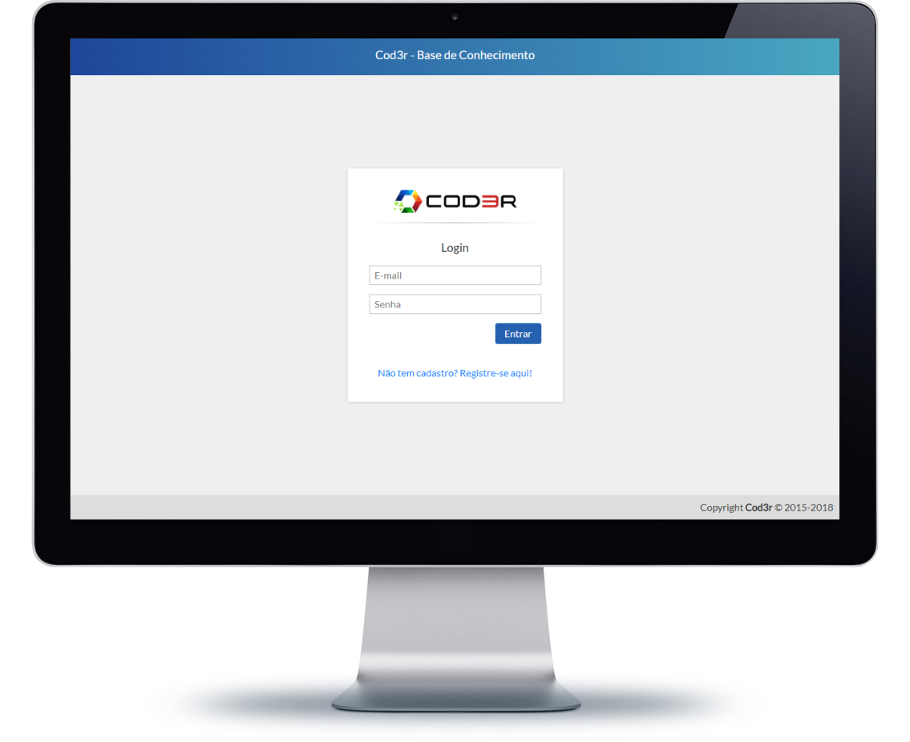
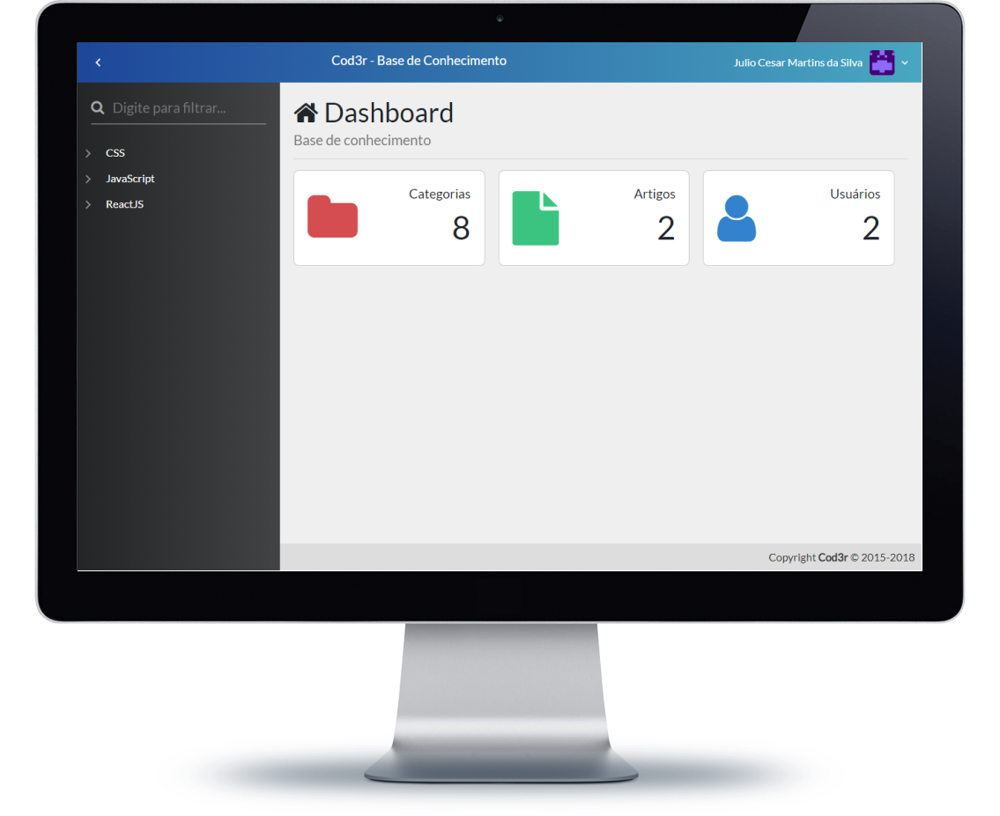
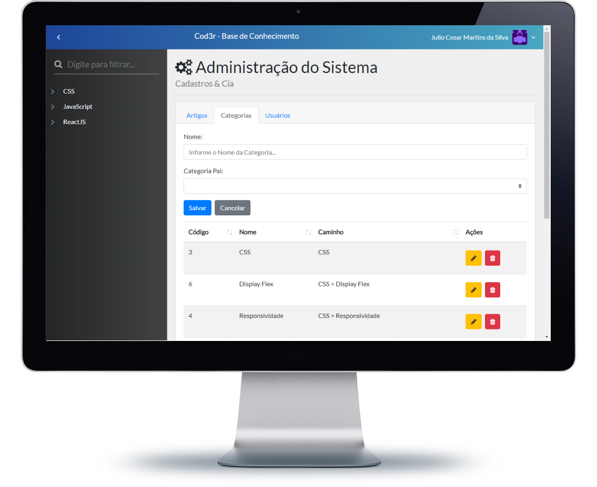
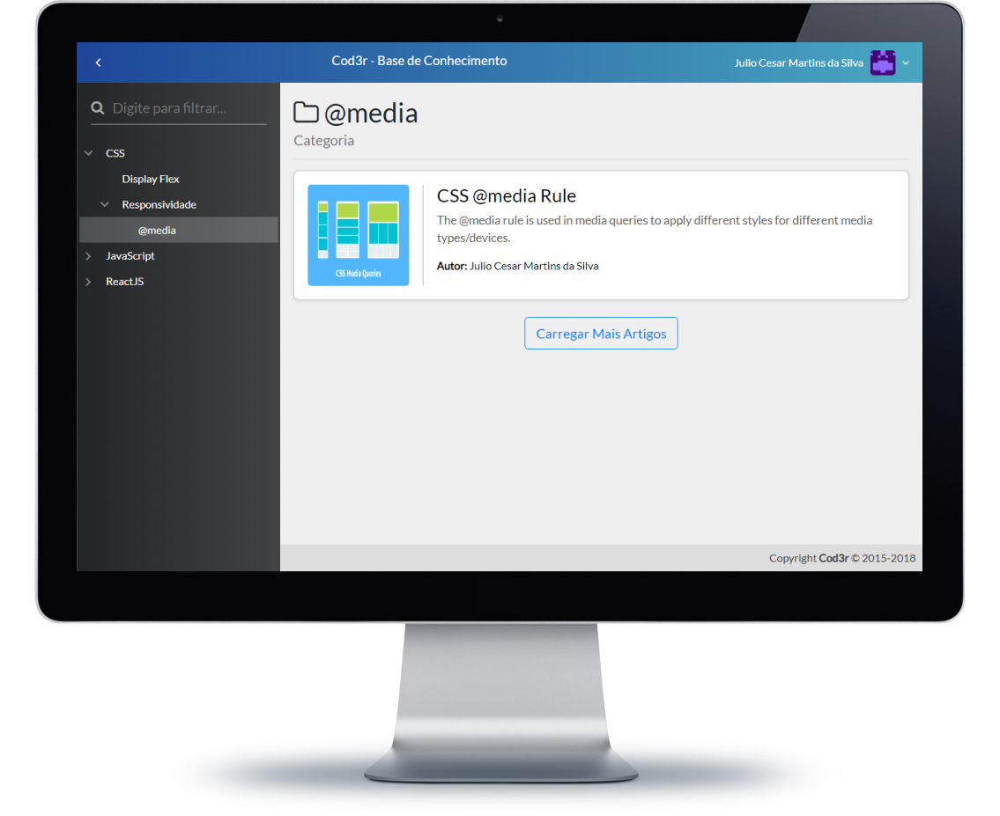
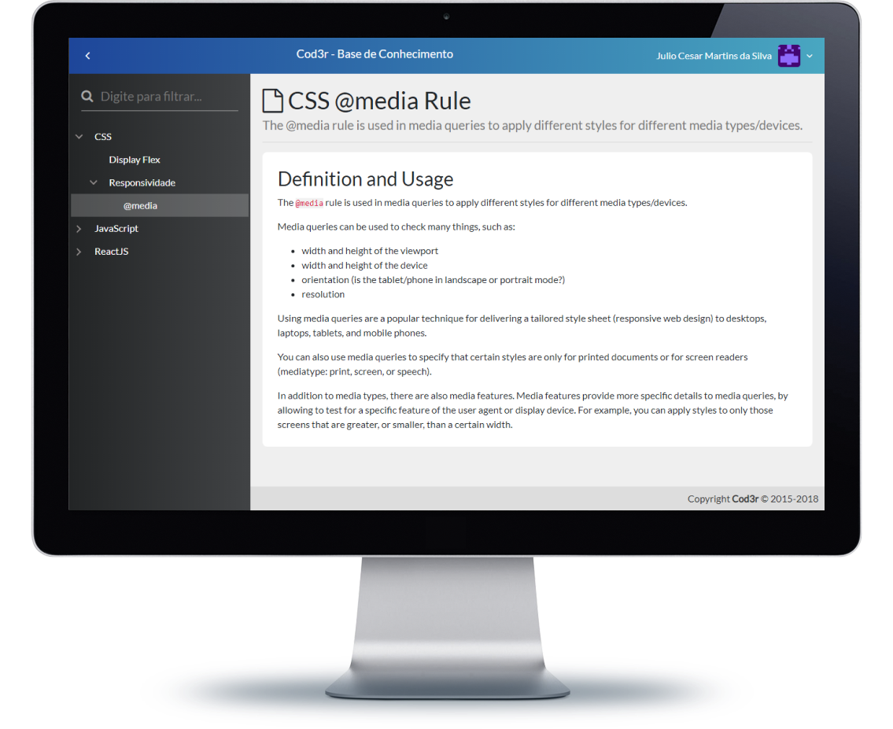

# Projeto Knowledge do curso Web Moderno Cod3r

###### Projeto para criação de posts

**Projeto basicamente se constituí de uma API REST feito com Node.js que alimenta o frontend construído com o framework VUE.**

### Backend: Node.js - Postgres - Mongo DB

### Frontend: Vue.js - VueStrap

# Página de Login

# Página Dashboard

# Página Home

# Página de Admin

# Página de Artigos

# Página de Detalhes do Artigo

